## 1. Introduction

The behavior of a flock of drones can be modeled using the three Reynolds rules:

- **Flock centering**: the effort to stay close to other agents within the flock.
- **Collision avoidance**: ensuring that drones do not collide with each other.
- **Velocity matching**: aligning velocity with nearby neighbors.

After implementing the necessary functions in the Python files `flock.py`, `drone.py`, and `utils.py`, the system is capable of controlling the flock and computing four key behavioral indicators for the group of aerial robots:

- **Normalized deviation energy**: Describes how much the group of drones deviates from an ideal configuration, where all team members are at an equal distance *d* from their neighbors.
- **Relative connectivity index**: Measures flock cohesion, ranging from **0** (no connected drones) to **1** (fully connected flock).
- **Cohesion radius**: Represents the maximum distance of a drone from the center of the group.
- **Normalized velocity mismatch**: Indicates how much each drone's velocity differs from the mean velocity of the group.

# Run

To run the script use:
```bash
python main.py
```
In the Class Drone() inside the drone.py file you can choose the type of the control just commenting out the one that you want:
```python
#cmd = u_alpha                     # Algorithm 1
cmd = u_alpha + u_gamma            # Algorithm 2
#cmd = u_alpha + u_gamma + u_beta  # Algorithm 3
```

# 2. Algorithm 1

The first algorithm has no group objective and describes only the interaction between two α-agents, ruled by the attractive or repulsive force between two neighbors, depending on their distance.


*Fragmentation phenomenon [OlfatiSaber2006].*

For this algorithm, three different initial areas have been tested: *10x10*, *20x20*, and *30x30*, to observe the behavior of the flock due to the attractive/repulsive force between the elements of the team. The force acts differently depending on how close the drones are in the initial configuration, using 4 indices.

## 2.1 Initial area of the flock: 10 x 10

The first choice produces an extremely chaotic flock, as the initial area is very tight. The flock at the initial time, at 2.5s, and after 5s is shown below.


*Initial configuration of the flock.*


*Configuration of the flock after 2.5s.*


*Configuration of the flock after 5s.*

It can be observed that the drones spread quickly, and only two links between α-agents survive over time. Hence, this is not a flock behavior and is undesirable.

The evolution of the 4 metrics is shown below:


*Metrics of the flock with initial area of 10 x 10.*

These plots confirm the observations in the flock images:
- **Connectivity** decreases, as only a few drones are connected.
- **Deviation energy** decreases from an initial value of approximately 0.35, as drones drift apart and don’t bond. It stabilizes around 0 after 2 seconds.
- **Cohesion radius** increases linearly as the flock doesn’t behave as a cohesive group.
- **Velocity mismatch** increases, stabilizing at approximately 15.

## 2.2 Initial area of the flock: 20 x 20

With this initial area, the drones are more spread at the first step, feeling a much weaker repulsive force compared to the 10x10 case.


*Initial configuration of the flock.*


*Configuration of the flock after 2.5s.*


*Configuration of the flock after 5s.*

The metrics show a more unbalanced connectivity compared to the 10x10 case, with some bounds lost and generated over time. The **deviation energy** decreases and stabilizes at a small value, but doesn’t reach a stationary value. The **velocity mismatch** stabilizes at approximately 6, a much smaller value than the 10x10 case. The **cohesion radius** increases linearly with a lower slope.


*Metrics of the flock with initial area of 20 x 20.*

## 2.3 Initial area of the flock: 30 x 30

With this wider initial area, the drones start with fewer links and a weaker repulsive force.


*Initial configuration of the flock.*


*Configuration of the flock after 2.5s.*


*Configuration of the flock after 5s.*

The drones are less spread compared to the 10x10 and 20x20 cases. The metrics show that the **connectivity** stabilizes at around 0.37, meaning more than one-third of the drones are connected. The **deviation energy** stabilizes at 0 after 3s, indicating no more drones are attempting to link. The **velocity mismatch** stabilizes at a value just above 1, and the **cohesion radius** grows with a smaller slope.


*Metrics of the flock with initial area of 30 x 30.*

# 3. Algorithm 2

The second algorithm is governed by both the attractive/repulsive force between α-agents and a navigational feedback, represented by a γ-agent, which provides a group objective and a moving meeting point.

## 3.1 Flock composed of 12 drones

The first test used 12 drones.


*Initial configuration of the flock.*


*Configuration of the flock after 5s.*


*Configuration of the flock after 10s.*

As shown, the drones start with few connections and begin to converge toward the group objective, creating new connections. By 10s, the flock adopts a crystalline geometry (α-lattice).


*Metrics of the flock composed of 12 drones with algorithm 2.*

The **connectivity** increases over time, reaching the maximum value of 1 at 5s. The **deviation energy** stabilizes around 0.005, indicating the flock is an α-lattice. The **velocity mismatch** reaches 0 after 8.5s, showing all drones move with the same velocity. The **cohesion radius** stabilizes just below 7.5 after approximately 8s.

## 3.2 Flock composed of 50 drones

The second algorithm was also tested with 50 drones.


*Initial configuration of the flock.*


*Configuration of the flock after 5s.*


*Configuration of the flock after 15s.*

At 15s, the flock has a crystalline geometry, similar to the 12 drone case.


*Metrics of the flock composed of 50 drones with algorithm 2.*

The **deviation energy** stabilizes at 0.02, very close to 0, indicating the flock is still an α-lattice. The **connectivity** and **velocity mismatch** are similar to the 12 drone case, and the **cohesion radius** stabilizes around 12, larger than for 12 drones due to the flock's size.

# 4. Algorithm 3

The third algorithm takes into account not only the attractive/repulsive force and navigational feedback but also the presence of obstacles, modeled as β-agents. The force between α-agents and β-agents is strictly repulsive if the drone is within a threshold distance (r_obs).

## 4.1 First obstacles disposition

The first set of obstacles consists of two circles and two walls. Two different trajectories were tested.

### 4.1.1 First trajectory

The evolution of the flock following the first trajectory is as follows:


*Initial disposition.*


*Flock after 5s.*


*Flock after 17.5s.*


*Flock after 25s.*


*Flock after 35s.*

From the metrics, the flock struggles to maintain connectivity due to obstacles but avoids crashing. After surrounding the obstacles, the flock re-forms, stabilizing the connectivity and deviation energy.


*Flock's metrics in presence of obstacles, first trajectory.*

The **connectivity** decreases initially but stabilizes to 1 after avoiding obstacles. The **deviation energy** goes to 0, and the **velocity mismatch** stabilizes at 0 when no obstacles are present. The **cohesion radius** starts high and decreases as the flock forms a cohesive group, increasing again as they pass through narrow openings.

### 4.1.2 Second trajectory

The second trajectory produces a less chaotic behavior, since the flock starts moving from a point that is closer to the obstacles. Contrary to what some might think, since they have to move towards the right, they go over the obstacles more easily than in the previous case, as shown in the figure below.

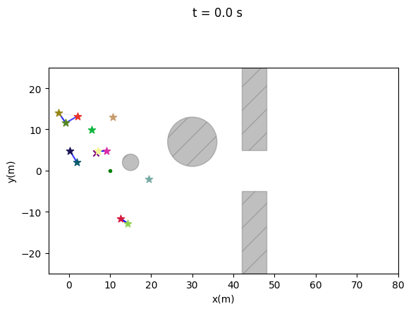
*Initial disposition.*

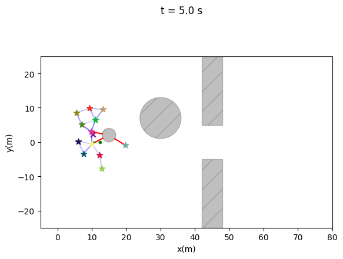
*Flock after 5 s.*

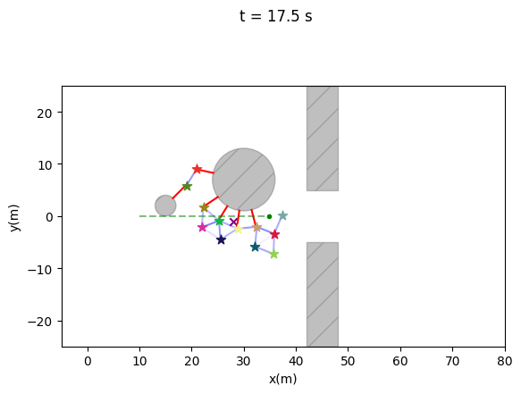
*Flock after 17.5 s.*

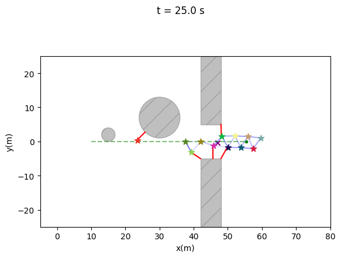
*Flock after 25 s.*

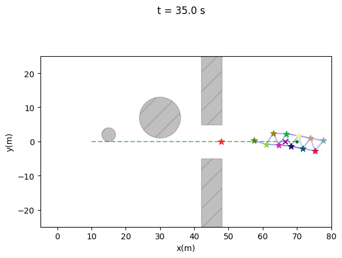
*Flock after 35 s.*

*Evolution of the flock with obstacles, second trajectory.*

The metrics also show a more ordered behavior, as shown in the figure below.

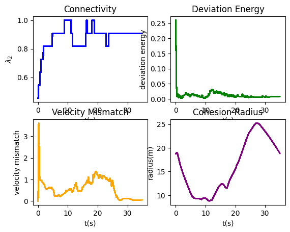
*Flock's metrics in presence of obstacles, second trajectory.*

In this example, the flock loses one drone, so the connectivity stabilizes at a value lower than 1. However, since the lost drone is too far from the others, the deviation energy eventually approaches 0 again, meaning that no drone is trying to reconnect to it. The velocity mismatch is overall low, but initially, there is a spike due to the drones gathering into a flock. Then, it flattens to a lower value, as every drone tries to follow the group's goal in a coordinated manner. The cohesion radius first decreases as they try to get as close as possible, then increases as they encounter obstacles and have to split. Eventually, they gather again after overcoming the obstacles, but do not become as compact as before, since they are moving in a column shape due to the opening between the two walls.

---

## 4.2 Second obstacles disposition

A different obstacle configuration was also tested, consisting of:
- Two circles: one with a radius of 3 centered at *(20,-10)* and another with a radius of 5 at *(25,7)*.
- Two walls, slightly shifted from the previous configuration:
  - The first wall is centered at *(45,25)* with dimensions *6x20*.
  - The second wall is centered at *(45,-15)* with dimensions *6x35*.

Moving the walls also shifted the opening between them, misaligning it with the reference trajectory of the centroid. This creates a different flock motion. The two tested trajectories were the same as in the previous obstacle configuration.

### 4.2.1 First trajectory

The flock initially gathers, follows the desired trajectory, and then, as predicted, encounters the wall. It moves around the wall and goes through the opening while following the reference, as shown below.

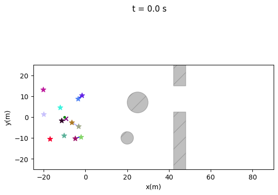
*Initial disposition.*

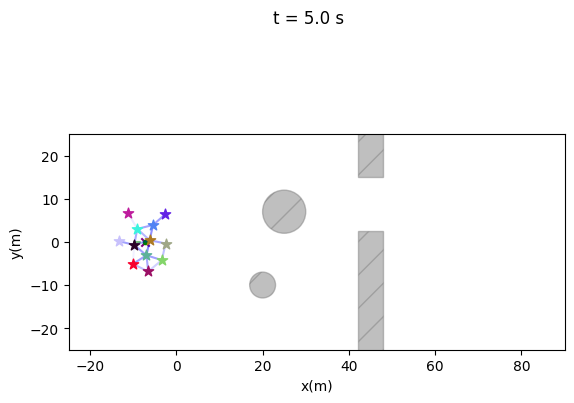
*Flock after 5 s.*

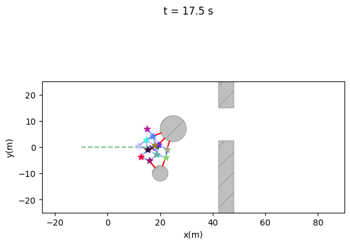
*Flock after 17.5 s.*

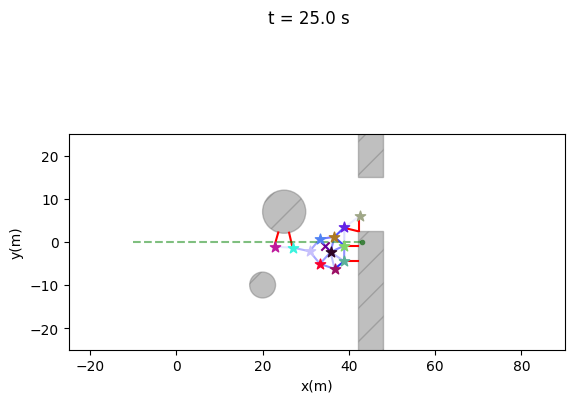
*Flock after 25 s.*

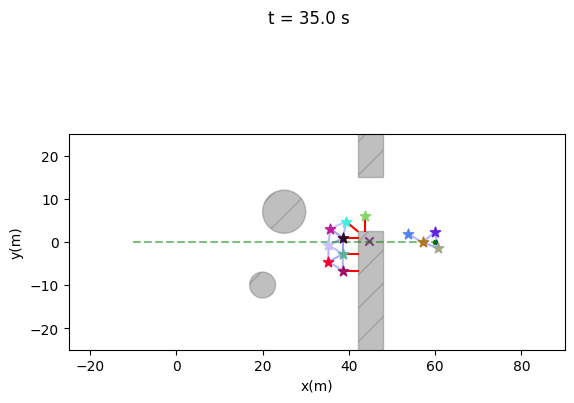
*Flock after 35 s.*

*Evolution of the flock with obstacles in alternative configuration, first trajectory.*

It is clear that the drones struggle more to follow the path since they need to avoid the wall. Looking at the metrics below, it's easy to recognize the different phases of the flock's behavior:
- Some links are broken in the final part to avoid crashing into the wall, causing connectivity to decrease.
- The **deviation energy** varies depending on the phase due to the presence of obstacles.
- The **velocity mismatch** changes significantly in different parts, since when a drone is close to an object, it needs to slow down to avoid crashing and to change its direction.
- The **cohesion radius** initially drops as the drones gather, then increases due to obstacle avoidance. The flock prioritizes avoiding obstacles over maintaining cohesion.

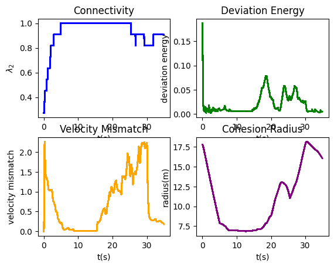
*Flock's metrics in presence of obstacles, second configuration, first trajectory.*

---

### 4.2.2 Second trajectory

Initially, the flock is quite spread out, with some drones very close to the obstacles, almost bordering them. This creates a strong repulsive force, pushing them away and making them attempt to form a cohesive flock. Again, the wall acts as a barrier against the centroid's reference trajectory. The flock moves around the wall and proceeds through the opening, but in a much less cohesive manner. The final step shows a highly fragmented group.

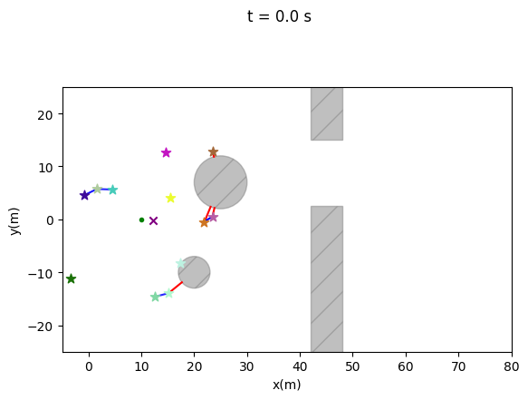
*Initial disposition.*

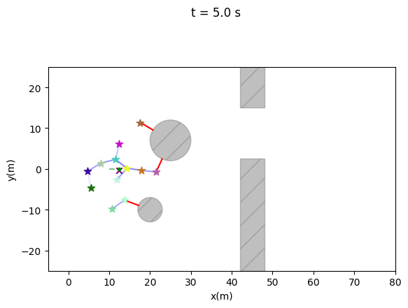
*Flock after 5 s.*

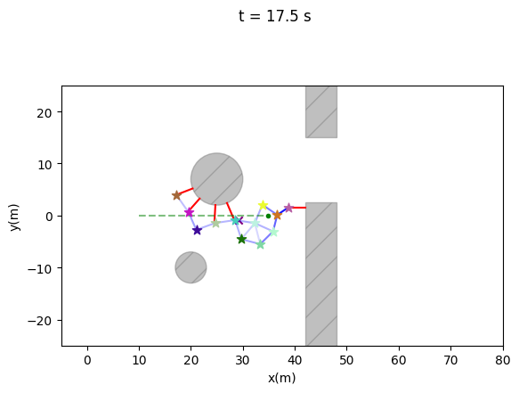
*Flock after 17.5 s.*

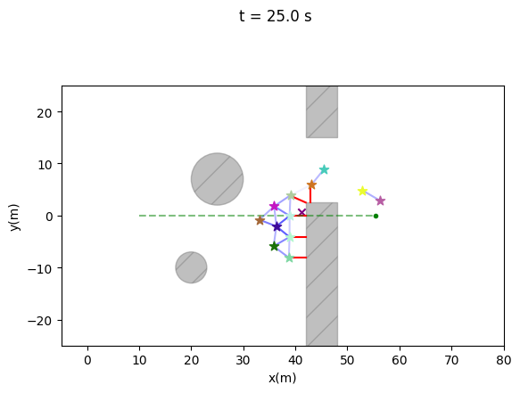
*Flock after 25 s.*

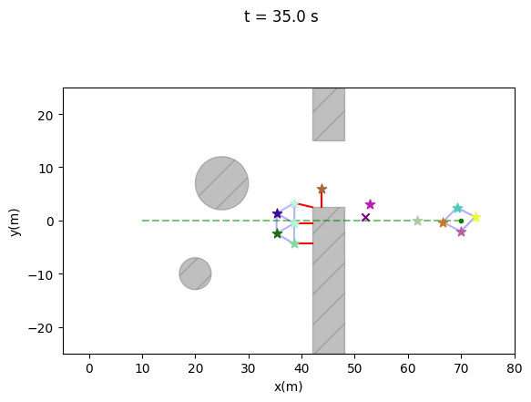
*Flock after 35 s.*

*Evolution of the flock with obstacles in alternative configuration, second trajectory.*

The metrics of this example, shown below, highlight key points:
- **Connectivity** drops when the drones need to split to avoid crashing into the wall.
- **Deviation energy** decreases initially as drones gather into a group and form links. Later, it exhibits peaks due to disconnection caused by obstacles. The final value approaches zero, as the disconnected drones are too far apart to reconnect.
- **Velocity mismatch** is high at first because the drones gather in different ways. It then flattens to zero when they move homogeneously before detecting obstacles. As they begin to avoid obstacles, it rises again, reflecting their varied reactions.
- **Cohesion radius** initially decreases as the drones form a cohesive group, then increases as they avoid obstacles, moving independently to prevent collisions. It remains high at the end due to the fragmented state of the flock.

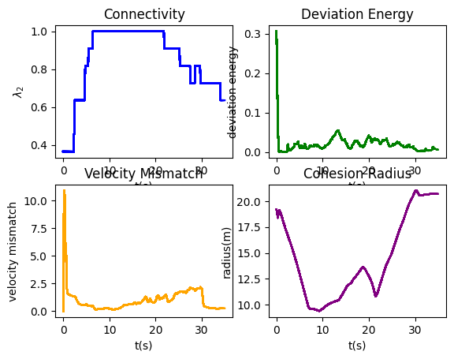
*Flock's metrics in presence of obstacles, second configuration, second trajectory.*

## 5. Conclusion

This report provides an overview of the implementation of the various algorithms presented in [Olfati-Saber, 2006], along with a critical analysis of flock behavior in different scenarios. 

The first algorithm is clearly less efficient in forming a cohesive flock compared to the second one. However, if the initial configuration is properly chosen, some **α-agents** may exhibit flocking behavior. Despite this, **fragmentation** occurs because the drones do not share a common objective. 

To address this issue, it is sufficient to introduce a group objective **γ-agent**, as demonstrated in the second algorithm. However, adding the **γ-agent** alone is not enough for obstacle avoidance, since obstacles are not considered in the algorithm. 

Obstacle avoidance is effectively implemented in the third algorithm, where the **β-agent** is introduced. All these observations were validated using key metrics such as **connectivity, deviation energy, cohesion radius,** and **velocity mismatch**.
