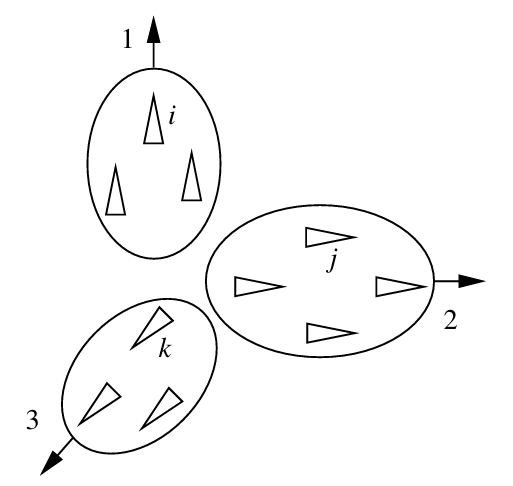
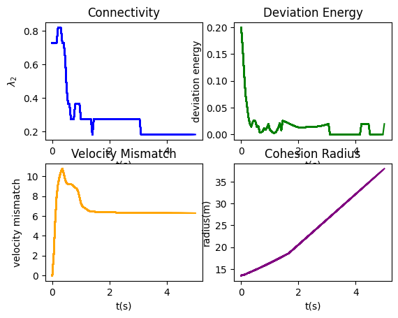
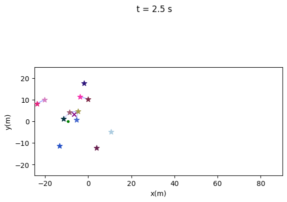

# 2. Algorithm 1

The first algorithm has no group objective and describes only the interaction between two α-agents, ruled by the attractive or repulsive force between two neighbors, depending on their distance.

*Fragmentation phenomenon [OlfatiSaber2006].*

For this algorithm, three different initial areas have been tested: *10x10*, *20x20*, and *30x30*, to observe the behavior of the flock due to the attractive/repulsive force between the elements of the team. The force acts differently depending on how close the drones are in the initial configuration, using 4 indices.

## 2.1 Initial area of the flock: 10 x 10

The first choice produces an extremely chaotic flock, as the initial area is very tight. The flock at the initial time, at 2.5s, and after 5s is shown below.

*Initial configuration of the flock.*

*Configuration of the flock after 2.5s.*

*Configuration of the flock after 5s.*

It can be observed that the drones spread quickly, and only two links between α-agents survive over time. Hence, this is not a flock behavior and is undesirable.

The evolution of the 4 metrics is shown below:

*Metrics of the flock with initial area of 10 x 10.*

These plots confirm the observations in the flock images:
- **Connectivity** decreases, as only a few drones are connected.
- **Deviation energy** decreases from an initial value of approximately 0.35, as drones drift apart and don’t bond. It stabilizes around 0 after 2 seconds.
- **Cohesion radius** increases linearly as the flock doesn’t behave as a cohesive group.
- **Velocity mismatch** increases, stabilizing at approximately 15.

## 2.2 Initial area of the flock: 20 x 20

With this initial area, the drones are more spread at the first step, feeling a much weaker repulsive force compared to the 10x10 case.

*Initial configuration of the flock.*

*Configuration of the flock after 2.5s.*

*Configuration of the flock after 5s.*

The metrics show a more unbalanced connectivity compared to the 10x10 case, with some bounds lost and generated over time. The **deviation energy** decreases and stabilizes at a small value, but doesn’t reach a stationary value. The **velocity mismatch** stabilizes at approximately 6, a much smaller value than the 10x10 case. The **cohesion radius** increases linearly with a lower slope.

*Metrics of the flock with initial area of 20 x 20.*

## 2.3 Initial area of the flock: 30 x 30

With this wider initial area, the drones start with fewer links and a weaker repulsive force.

*Initial configuration of the flock.*

*Configuration of the flock after 2.5s.*

*Configuration of the flock after 5s.*

The drones are less spread compared to the 10x10 and 20x20 cases. The metrics show that the **connectivity** stabilizes at around 0.37, meaning more than one-third of the drones are connected. The **deviation energy** stabilizes at 0 after 3s, indicating no more drones are attempting to link. The **velocity mismatch** stabilizes at a value just above 1, and the **cohesion radius** grows with a smaller slope.

*Metrics of the flock with initial area of 30 x 30.*

# 3. Algorithm 2

The second algorithm is governed by both the attractive/repulsive force between α-agents and a navigational feedback, represented by a γ-agent, which provides a group objective and a moving meeting point.

## 3.1 Flock composed of 12 drones

The first test used 12 drones.

*Initial configuration of the flock.*

*Configuration of the flock after 5s.*

*Configuration of the flock after 10s.*

As shown, the drones start with few connections and begin to converge toward the group objective, creating new connections. By 10s, the flock adopts a crystalline geometry (α-lattice).

*Metrics of the flock composed of 12 drones with algorithm 2.*

The **connectivity** increases over time, reaching the maximum value of 1 at 5s. The **deviation energy** stabilizes around 0.005, indicating the flock is an α-lattice. The **velocity mismatch** reaches 0 after 8.5s, showing all drones move with the same velocity. The **cohesion radius** stabilizes just below 7.5 after approximately 8s.

## 3.2 Flock composed of 50 drones

The second algorithm was also tested with 50 drones.

*Initial configuration of the flock.*

*Configuration of the flock after 5s.*

*Configuration of the flock after 15s.*

At 15s, the flock has a crystalline geometry, similar to the 12 drone case.

*Metrics of the flock composed of 50 drones with algorithm 2.*

The **deviation energy** stabilizes at 0.02, very close to 0, indicating the flock is still an α-lattice. The **connectivity** and **velocity mismatch** are similar to the 12 drone case, and the **cohesion radius** stabilizes around 12, larger than for 12 drones due to the flock's size.

# 4. Algorithm 3

The third algorithm takes into account not only the attractive/repulsive force and navigational feedback but also the presence of obstacles, modeled as β-agents. The force between α-agents and β-agents is strictly repulsive if the drone is within a threshold distance (r_obs).

## 4.1 First obstacles disposition

The first set of obstacles consists of two circles and two walls. Two different trajectories were tested.

### 4.1.1 First trajectory

The evolution of the flock following the first trajectory is as follows:

*Initial disposition.*

*Flock after 5s.*

*Flock after 17.5s.*

*Flock after 25s.*

*Flock after 35s.*

From the metrics, the flock struggles to maintain connectivity due to obstacles but avoids crashing. After surrounding the obstacles, the flock re-forms, stabilizing the connectivity and deviation energy.

*Flock's metrics in presence of obstacles, first trajectory.*

The **connectivity** decreases initially but stabilizes to 1 after avoiding obstacles. The **deviation energy** goes to 0, and the **velocity mismatch** stabilizes at 0 when no obstacles are present. The **cohesion radius** starts high and decreases as the flock forms a cohesive group, increasing again as they pass through narrow openings.
