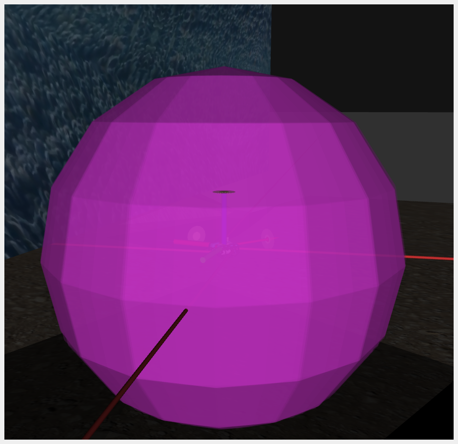

# Introduction
In this laboratory, it was required to control an **Autonomous Underwater Vehicle** (*AUV*), equipped with thrusters (see Figure 14). The task of the robot is to be able to follow a set of *waypoints* run through *Gazebo*, with a chosen position and orientation, and then proceed to estimate its pose through the application of the *Extended Kalman Filter*.

## 1. Waypoints Following
The first task was to modify the node defined in `waypoint.cpp`, to loop through the waypoints defined in `waypoints.yaml`. Due to uncertainty of the AUV, it may not perfectly reach the desired position. For this reason, two thresholds were used to ensure the desired accuracy in *position* and in *orientation*. 

In practice, a double check was implemented for both thresholds. Since the waypoints are defined by an index, if the AUV passes the double check, the index is incremented. When the last waypoint is reached, the index is reset to 0.

The following figures show the trajectory of the AUV (red arrows), starting from the initial position (red box), and the position of the *waypoints* (green circles) during this task.

*Figure 1: Starting position of the AUV.*

*Figure 2: Trajectory to the first waypoint.*

*Figure 3: Trajectory to the second and third waypoints.*

*Figure 4: Trajectory to the fourth and fifth waypoints.*

*Figure 5: Trajectory to the sixth and seventh waypoints.*

*Figure 6: Trajectory to the eighth and ninth waypoints.*

*Figure 7: Trajectory from the last to the first waypoint.*

In Figures 3, 4, 5, and 6, the waypoints coincide in position but differ in orientation. This means that once the AUV reaches the position of a waypoint, it then rotates to satisfy the orientation of the second waypoint.

### Waypoints List:

| Waypoint | x   | y   | z  | theta |
|----------|-----|-----|----|-------|
| 1st      | -180 | -20 | -7 | 3.14  |
| 2nd      | -180 | -40 | -7 | 3.14  |
| 3rd      | -180 | -40 | -7 | 1.57  |
| 4th      | -220 | -40 | -7 | 1.57  |
| 5th      | -220 | -40 | -7 | 0     |
| 6th      | -220 | 0   | -7 | 0     |
| 7th      | -220 | 0   | -7 | -1.57 |
| 8th      | -180 | 0   | -7 | -1.57 |
| 9th      | -180 | 0   | -7 | -3.14 |

## 2. Pose Estimation from Extended Kalman Filter
To make the simulation more realistic, the ground truth concerning the pose was substituted by its estimation performed by the *Extended Kalman Filter*. The ground truth was taken as absolute true position, which, in real experiments, is not known.

To simulate the noise, the ground truth is contaminated by adding noise, then it is published on the topic of the sensors:
- **Depth sensor**
- **USBL (Ultra-Short Baseline)**: underwater acoustic positioning method
- **Two IMUs (Inertial Measurement Units)**: record orientation and angular velocity

Each sensor is defined as a vector of 15 Boolean entries, with specific values indicating whether a measure is acquired by the sensor.

### Example: Depth Sensor Truth Table

| Measure   | Value |
|-----------|-------|
| x         | false |
| y         | false |
| z         | true  |
| yaw       | false |
| pitch     | false |
| roll      | false |
| v_x       | false |
| v_y       | false |
| v_z       | false |
| omega_x   | false |
| omega_y   | false |
| omega_z   | false |
| a_x       | false |
| a_y       | false |
| a_z       | false |

It is possible to notice that the only measured value is the position along *z*, namely the depth.

After implementing this list of values for each sensor, the simulation was performed with four different combinations of sensing units, comparing the ellipsoids representing the uncertainty related to the robot's positioning.

### Error Ranges:

| Measure | Initial Range | Modified Range |
|---------|--------------|---------------|
| x,y,z   | 1 m          | 2 m           |
| z       | 0.3 m        | 0.6 m         |
| r,p,y   | 2°           | 4°            |
| w       | 0.035°/s     | 0.07°/s       |
| a       | 0.0981 m/s²  | 0.0981 m/s²   |

where:
- *x,y,z* are from the USBL
- *z* is from the depth sensor
- *r,p,y* (roll, pitch, yaw) are from the IMU
- *w* (angular velocity) is from the IMU
- *a* (linear acceleration) is from the IMU

### Performance Comparison:

#### One IMU:

*Figure 8: One IMU with Default Noise.*

*Figure 9: One IMU with Double Noise.*

#### Two IMUs:

*Figure 10: Two IMU with Default Noise.*

*Figure 11: Two IMU with Double Noise.*

#### Two IMUs + Depth Sensor:

*Figure 12: Two IMU + Depth Sensor with Default Noise.*

*Figure 13: Two IMU + Depth Sensor with Double Noise.*

It is visible that the ellipsoids collapse into a **2D shape**, since the depth is no longer uncertain thanks to the information added by the sensor.

#### All Sensors Combined:

*Figure 14: All Sensors with Default Noise.*

*Figure 15: All Sensors with Double Noise.*

In Figures above, the best position estimation is obtained with **all sensors combined**, resulting in the smallest ellipsoid. With higher noise, the ellipsoid slightly increases in size, but the estimation remains the most accurate among all cases.

